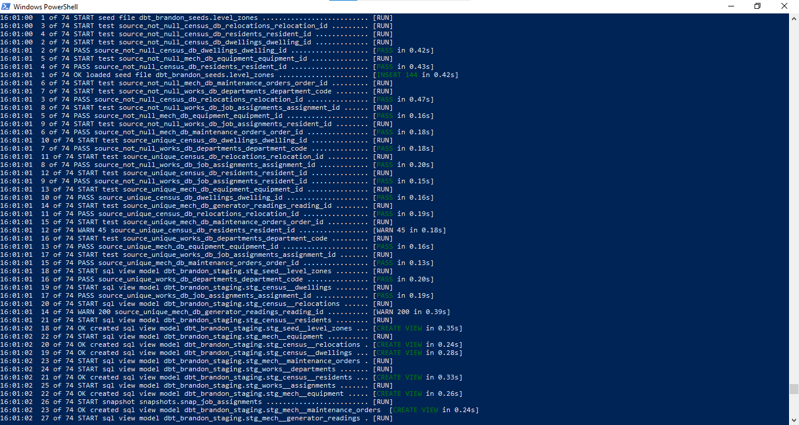

# Silo Operations Analytics

A dbt + PostgreSQL analytics pipeline built end to end: three source systems, eleven planted data-quality problems, an SCD2 snapshot, an incremental model, and 54 data tests.

The setting is fictional — an underground silo with 144 levels, borrowed from the Apple TV series. The engineering is not. The dataset was generated with deliberate defects modelled on the ones that actually break production pipelines: duplicate rows from failed syncs, empty strings masquerading as nulls, sensor faults, unmapped reference codes, and records arriving days after the timestamp they carry.


**[→ Browse the interactive lineage graph and data catalog](https://brandonmuch.github.io/silo-analytics-dbt/)**

---

## The brief

Three departments run their own systems and none of them talk to each other. Leadership wants a single source of truth. Four questions came in:

| Stakeholder | Question | Model |
| :--- | :--- | :--- |
| **Supply** | Which levels are gaining and losing population? We're allocating rations off a two-year-old headcount. | `fct_level_monthly_occupancy` |
| **Mechanical** | Can we see a generator degrading before it fails? | `fct_generator_daily_output` |
| **Works** | How many people does each department actually have, versus its establishment? | `fct_department_monthly_staffing` |
| **Judicial** | Where do sanctioned relocations cluster? | `stg_census__relocations` → marts |

Three of those need a value **as it was in the past**, not as it is now. That constraint drove most of the architecture.

---

## Architecture

```
RAW (Postgres — dbt reads only)      STAGING (views)                INTERMEDIATE                    MARTS (tables)

census_db.residents        ──►  stg_census__residents      ──┐
census_db.dwellings        ──►  stg_census__dwellings      ──┼──► int_resident_dwelling_history
census_db.relocations      ──►  stg_census__relocations    ──┘             │
                                                                           ▼
seed: level_zones          ──►  stg_seed__level_zones      ────►  int_level_monthly_population ──► fct_level_monthly_occupancy
                                                                                                            │
works_db.departments       ──►  stg_works__departments     ──┐                                              ▼
works_db.job_assignments   ──►  stg_works__assignments     ──┼──► int_assignment_months ──► fct_department_monthly_staffing
       └──► snap_job_assignments (SCD2) ──────────────────┘

mech_db.generator_readings ──►  stg_mech__generator_readings ──► int_generator_daily ──► fct_generator_daily_output
mech_db.equipment          ──►  stg_mech__equipment         ──┐         [incremental]
mech_db.maintenance_orders ──►  stg_mech__maintenance_orders─┴───────────────────────────► dim_levels
```

**Layer rules.** A model may only read from the layer immediately above it. dbt never writes to raw. Staging is one raw table in, one model out — no joins. Joins live in intermediate so marts stay legible. Marts are the only tables; everything upstream is a view.

| Layer | Count | Materialization | Job |
| :--- | ---: | :--- | :--- |
| Sources | 8 | — | Declared with descriptions, tests, freshness thresholds |
| Seed | 1 | table | Hand-maintained level→zone mapping (144 rows) |
| Staging | 9 | view | Cast, clean, normalise. No joins. |
| Snapshot | 1 | table | SCD2 history of a mutable source |
| Intermediate | 4 | view / incremental | Joins, date spines, aggregation |
| Marts | 4 | table | Business entities and metrics |
| Tests | 54 | — | Generic, singular, and grain |

---

## The bug my tests didn't catch

The most useful thing in this project is a mistake.

`fct_level_monthly_occupancy` built cleanly. The grain test passed. Every `not_null`, `accepted_values`, and row count was exactly right — 5,184 rows, 36 months, 144 levels, no duplicates.

Then I looked at the output distribution:

```
occupancy_trend | count
----------------+-------
stable          |  5040
baseline        |   144
```

**Zero growing, zero shrinking.** Population never changed on any level in any month across three years.

### The cause

The join was cumulative rather than point-in-time:

```sql
-- counts everyone registered before this month, and never removes anyone
and residents.registered_at < (level_months.month_start + interval '1 month')
```

Worse, the upstream model resolved each resident to their **current** dwelling, so everyone was retroactively assigned to where they live today. The result was a monotonic count that, since almost everyone registered before the window opened, was flat.

`stg_census__relocations` — 6,500 records of who moved where and when — was sitting unused.

### The fix

Built `int_resident_dwelling_history`, which reconstructs each resident's dwelling timeline by turning discrete move events into date ranges. `lead()` closes each residency at the next move; the most recent move stays open-ended. `distinct on` recovers the period before a resident's first move.

Then rewrote the population model to range-join against that history rather than against current state:

```sql
and residency_levels.valid_from < (level_months.month_start + interval '1 month')
and (
        residency_levels.valid_to is null      -- still living there
     or residency_levels.valid_to >= level_months.month_start
    )
```

Result:

```
occupancy_trend | count
----------------+-------
shrinking       |  1697
growing         |  1675
stable          |  1668
baseline        |   144
```

Grain held through the rewrite: still 5,184 / 36 / 144.

### What it demonstrates

Structural tests verify shape, not meaning. Uniqueness, nullability, and row counts were all correct while the model answered the wrong question. The only thing that caught it was looking at the output and asking whether it was plausible.

---

## The eleven planted problems

| # | Problem | Handled |
| :-- | :--- | :--- |
| 1 | `status` in four casings (`active`, `Active`, `ACTIVE`, `' active '`) | Normalised in staging via `case` over `trim(lower())` |
| 2 | Empty strings and an undocumented `unregistered` value | `nullif(trim(lower(x)), '')`, mapped to an explicit `unknown` category rather than null so the rows stay countable |
| 3 | 45 duplicate residents from a failed replication batch | `row_number()` dedup keeping the latest sync; source test set to `warn` and documented |
| 4 | ~1.5% soft-deleted rows | `where not is_deleted` — the only filter in staging, since it's a replication artefact rather than a business state |
| 5 | ~2% of assignments carry department codes absent from the reference table | `left join` + `coalesce(..., 'UNMAPPED')`. 169 assignments retained and visible; an inner join would have deleted them silently |
| 6 | `ended_at` is an **empty string**, not null, for current assignments | `cast(nullif(trim(ended_at), '') as timestamp)`. Without it, all 7,181 open-ended assignments fail the range join's null branch and 65% of the workforce vanishes from the staffing report — with no error |
| 7 | Negative and null generator outputs from sensor faults | **Nulled, not deleted.** A deleted row makes a sensor fault indistinguishable from an outage. `is_faulty_reading` keeps the count visible |
| 8 | 200 duplicate readings from double-syncs | `row_number()` dedup; source test set to `warn` |
| 9 | **767 readings sync up to 9 days after `read_at`** | Measured the lag, then sized a 14-day lookback window on the incremental model. See below |
| 10 | 39 maintenance orders close before they open | Singular test at `warn` severity. Consistent sub-24h negative offsets — diagnosed as a clock issue and left uncorrected, since the orders carry real labour hours |
| 11 | Job assignments updated in place, destroying history | `snap_job_assignments` — SCD2 snapshot against the source |

---

## Engineering decisions

**The lookback window was measured, not guessed.** The naive incremental filter is `where read_at > (select max(read_at) from {{ this }})`. Against this source it would permanently lose 767 rows, silently. Querying `synced_at - read_at` gave a worst case of 9 days, so the window is 14 with headroom:

```sql

where read_at >= (
    select coalesce(max(reading_date), '1900-01-01'::date) - interval '14 days'
    from {{ this }}
)

```

The lookback is only safe because `unique_key` drives a `delete+insert`. Verified idempotent: after three runs, 6,576 rows and 6,576 distinct keys. Run one processed 157,824 readings in 2.76s; run two touched 90 rows in 0.86s.

**Flags, not filters.** No mart contains a `WHERE` on business state. Filtering inside a fact table destroys information permanently — filter out empty levels and you've deleted the denominator for every occupancy rate. `is_empty_level`, `is_understaffed`, and `is_below_975pct_baseline` are exposed as booleans; consumers decide.

**Warn, don't block, on upstream problems.** Three tests are set to `severity: warn` with a comment naming who's been told. Known-broken source data shouldn't halt a pipeline, but silencing it means it gets forgotten. `fct_department_monthly_staffing` documents in its model description that `headcount` is reliable while `establishment_fill_rate` is not, pending correction of the Works reference data — fill rates run 2.6x to 25x, which is a reference-data problem rather than a modelling one.

**Thresholds tuned against observed behaviour.** The generator degradation flag started at 90% of baseline and never fired: measured decline is ~1.5% over three years. Retuned to 97.5%, which produces a ranked maintenance worklist with a crossing date per generator.

**Business logic encoded once.** Month-over-month movement, occupancy trend classification, and criticality ranking live in the pipeline rather than in a BI tool. Two dashboards computing a metric independently is how two people bring different numbers to the same meeting.

---

## Running it

Requires PostgreSQL 14+, Python 3.9+, and dbt Core with `dbt-postgres`.

```bash
# 1. Generate the synthetic source data (stdlib only, seeded - reproducible)
python generate_silo_data.py

# 2. Create the database and load the raw layer
createdb silo
psql -d silo -f silo_raw/load_raw.sql

# 3. Configure ~/.dbt/profiles.yml with a 'silo_analytics' profile pointing at it

# 4. Build
dbt deps
dbt build
```

`dbt build` rather than `dbt run` — it interleaves tests in DAG order and skips downstream models when an upstream test fails, so bad data stops at the point of failure instead of reaching a mart.

```bash
dbt docs generate && dbt docs serve   # lineage graph and column-level catalog
```



---

## Stack

PostgreSQL 18 · dbt Core 1.12 · dbt-postgres 1.11 · dbt_utils

**Techniques used:** CTEs, window functions (`lag`, `lead`, `first_value`, `row_number`, explicit rolling frames), `generate_series` date spines, range joins with explicit null branches, `distinct on`, `filter` clauses for conditional aggregation, surrogate keys, `nullif` guards on division and casting.
